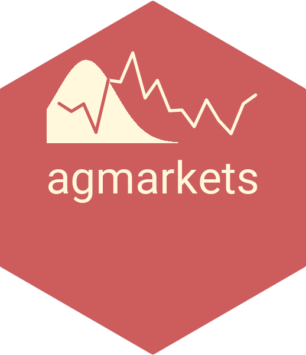

  

<!-- {target="_blank"} -->

  

[Lecture 1: Preferences and Demand](https://dubilava.github.io/agmarkets_slides/01-Demand.html){target="_blank"}

[Lecture 2: Supply and Market Structure](https://dubilava.github.io/agmarkets_slides/02-Supply.html){target="_blank"}

[Lecture 3: Marketing System and Margins](https://dubilava.github.io/agmarkets_slides/03-Vertical.html){target="_blank"}

[Lecture 4: Spatial Integration and Trade](https://dubilava.github.io/agmarkets_slides/04-Spatial.html){target="_blank"}

[Lecture 5: Storage and Price Dynamics](https://dubilava.github.io/agmarkets_slides/05-Temporal.html){target="_blank"}

[Lecture 6: Futures Markets](https://dubilava.github.io/agmarkets_slides/06-Futures.html){target="_blank"}

[Lecture 7: Risk, Insurance, and Pricing Policy](https://dubilava.github.io/agmarkets_slides/07-Risk.html){target="_blank"}

[Lecture 8: Trade Policy and Negotiations](https://dubilava.github.io/agmarkets_slides/08-TradePolicy.html){target="_blank"}

[Lecture 9: Price Discovery](https://dubilava.github.io/agmarkets_slides/09-PriceDiscovery.html){target="_blank"}

[Lecture 10: Prices and Conflict](https://dubilava.github.io/agmarkets_slides/10-Conflict.html){target="_blank"}

