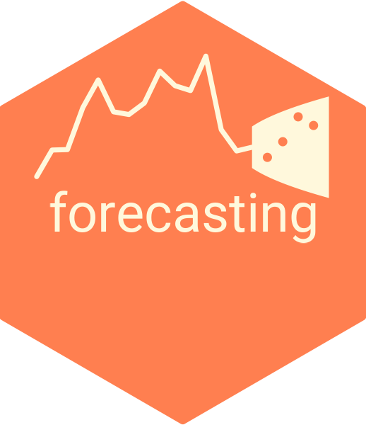

  

<!-- {target="_blank"} -->

  

[Lecture 1: Introduction](https://dubilava.github.io/forecasting_slides/01-Intro.html){target="_blank"}

[Lecture 2: Basics of Forecasting](https://dubilava.github.io/forecasting_slides/02-Basics.html){target="_blank"}

[Lecture 3: Time Series](https://dubilava.github.io/forecasting_slides/03-TimeSeries.html){target="_blank"}

[Lecture 4: Trends and Seasonality](https://dubilava.github.io/forecasting_slides/04-TrendSeason.html){target="_blank"}

[Lecture 5: Autoregression](https://dubilava.github.io/forecasting_slides/05-Autoregression.html){target="_blank"}

[Lecture 6: Vector Autoregression](https://dubilava.github.io/forecasting_slides/06-Multivariate.html){target="_blank"}

[Lecture 7: Threshold Autoregression](https://dubilava.github.io/forecasting_slides/07-Nonlinear.html){target="_blank"}

[Lecture 8: Forecast Comparison Tests](https://dubilava.github.io/forecasting_slides/08-Accuracy.html){target="_blank"}

[Lecture 9: Forecast Combination](https://dubilava.github.io/forecasting_slides/09-Combination.html){target="_blank"}

[Lecture 10: Multi-Step Forecasting Methods](https://dubilava.github.io/forecasting_slides/10-Direct.html){target="_blank"}

