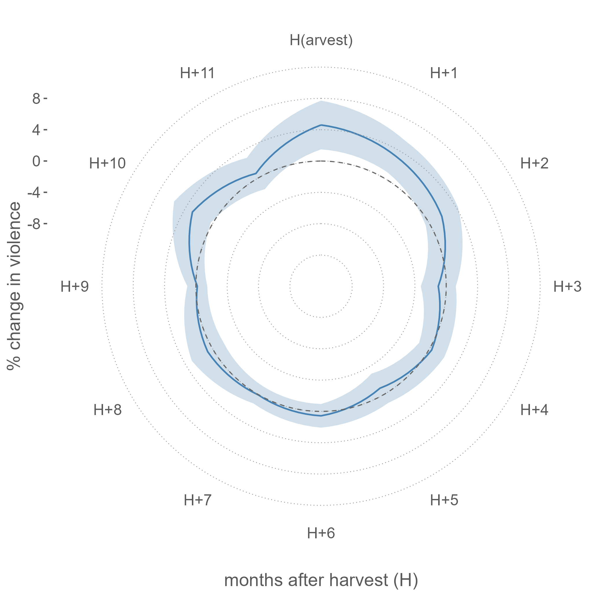

## Work in progress

--\ Roads and Riots *(with Ashani Amarasinghe and Joshua Merfeld)*.

--\ Market Concentration and Resilience in Agricultural Supply Chains *(with Timothy Richards and Mikaela Polyviou)*

## Publications

[25]\ Hastings, J.V., and D. Ubilava (accepted). Agricultural Roots of Social Conflict in Southeast Asia. *Journal of Peace Research*. [Working Paper](https://arxiv.org/abs/2304.10027){target="_blank"}. [Data and Replication Material](https://github.com/dubilava/seasia){target="_blank"}.

[24]\ Ubilava, D. (accepted). Climate, Crops, and Postharvest Conflict. *American Journal of Agricultural Economics*. [Working Paper](https://arxiv.org/abs/2311.16370){target="_blank"}. [Data and Replication Material](https://github.com/dubilava/elnino){target="_blank"}.

[23]\ Ubilava, D., Hastings, J.V., and K. Atalay (2023). [Agricultural Windfalls and the Seasonality of Political Violence in Africa](https://onlinelibrary.wiley.com/doi/full/10.1111/ajae.12364){target="_blank"}. *American Journal of Agricultural Economics 105(5)*, 1309-1332. [Working Paper](https://arxiv.org/abs/2202.07863){target="_blank"}. [Data and Replication Material](https://github.com/dubilava/conflict){target="_blank"}. Media coverage: [Vox EU](https://voxeu.org/article/rising-cereal-prices-and-political-violence-croplands-africa){target="_blank"}.

*When the prices of cereal grains rise, social unrest and conflict become likely. In rural areas, the predation motives of perpetrators can explain the positive relationship between prices and conflict. Predation happens at places and in periods where and when spoils to be appropriated are available. In predominantly agrarian societies, such opportune times align with the harvest season. Does the seasonality of agricultural income lead to the seasonality of conflict? We address this question by analyzing over 55 thousand incidents involving violence against civilians staged by paramilitary groups across Africa during the 1997–2020 period. We investigate the crop year pattern of violence in response to agricultural income shocks via changes in international cereal prices. We find that a year-on-year one standard deviation annual growth of the price of the major cereal grain results in a harvest-time spike in violence by militias in areas where this cereal grain is grown. This translates to a nearly ten percent increase in violence during the early postharvest season. We observe no such change in violence by state forces or rebel groups—the other two notable actors. By further investigating the mechanisms, we show that the violence by militias is amplified after plausibly rich harvest seasons when the value of spoils to be appropriated is higher. By focusing on harvest-related seasonality of conflict, as well as actors more likely to be involved in violence against civilians, we contribute to the growing literature on the economic causes of conflict in predominantly agrarian societies.*

[22]\ Ferguson, S., and D. Ubilava (2022). [Global Commodity Market Disruption and the Fallout](https://doi.org/10.1111/1467-8489.12497){target="_blank"}. *Australian Journal of Agricultural and Resource Economics 66(4)*, 737-752.

[21]\ Ubilava, D. (2022). [A Comparison of Multistep Commodity Price Forecasts Using Direct and Iterated Smooth Transition Autoregressive Methods](https://doi.org/10.1111/agec.12707){target="_blank"}. *Agricultural Economics 53(5)*, 687-701.

[20]\ Hastings, J.V., S.G. Phillips, Ubilava, D., and A. Vasnev (2022). [Price Transmission in Conflict--Affected States: Evidence from Cereal Markets of Somalia](https://doi.org/10.1093/jae/ejab012){target="_blank"}. *Journal of African Economies 31(3)*, 272-291. [Working Paper](https://ideas.repec.org/p/syd/wpaper/2020-16.html){target="_blank"}. [Data and Replication Material](https://github.com/dubilava/somalia){target="_blank"}.

*How integrated are agricultural markets in conflict-affected states? We answer this question by examining the dynamics of monthly price series of rice, maize, and sorghum across eleven cities (markets) of Somalia. Using conflict as a source of transaction costs between spatially connected markets, we examine its role in price transmission between the markets in a panel smooth transition regression framework. We find that in the case of rice—an imported cereal grain—conflict tends to reduce the speed of price transmission between markets. By contrast, we find no evidence of conflict-related transaction costs in the case of maize and sorghum—commodities that are locally produced, particularly in the central and southern parts of Somalia. In all instances, we find that there is some degree of spatial integration among cereal markets around the country, perhaps partly due to informal institutions that can bridge the divides created by conflict, distance, and internal political fragmentation. These findings add crucial detail to the literature concerned with the role of commodity prices on poverty and food security in conflict-affected states.*

[19]\ Angus, S.D., K. Atalay, J. Newton, and D. Ubilava (2021). [Geographic Diversity in Economic Publishing](https://doi.org/10.1016/j.jebo.2021.08.005){target="_blank"}. *Journal of Economic Behavior and Organization 190*, 255-262. [Working Paper](https://dx.doi.org/10.2139/ssrn.3697906){target="_blank"}. [Data and Replication Material](https://github.com/specialistgeneralist/geodiverse){target="_blank"}. [Dedicated Twitter Account](https://twitter.com/geo_diverse){target="_blank"}. Media coverage: [Vox EU](https://voxeu.org/article/geographic-diversity-economics-journals-editorial-boards){target="_blank"}

*Is the representation of editors at prestigious economics journals geographically diverse? Using data on the affiliations of academics working in an editorial capacity at such journals, we map the locations of editorial power within the economics profession. This allows us to rank institutions according to this measure of power. Further, by considering the average distance of a journal's editorial affiliations from a geographic mean, we rank journals by geographic diversity. We find that power is concentrated in five geographical hubs and that most editorial teams are less geographically diverse and more North American than the authors they publish.*

[18]\ Atalay, K., R. Edwards, S. Schurer, and D. Ubilava (2021). [Lives Saved During Economic Downturns: Evidence from Australia](https://doi.org/10.1002/hec.4394){target="_blank"}. *Heath Economics 30(10)*, 2452-2467. [Working Paper](https://www.iza.org/publications/dp/13742/lives-saved-during-economic-downturns-evidence-from-australia){target="_blank"}. Media coverage: [Vox EU](https://voxeu.org/article/lives-saved-during-economic-downturns){target="_blank"}, [The Conversation](https://theconversation.com/so-you-think-economic-downturns-cost-lives-our-findings-show-they-dont-149711){target="_blank"}

[17]\ Ubilava, D., N.B. Villoria, and J.B. Tack (2019). [Smooth Transitions Across Latitudes and Longitudes: An Application of a Nonlinear Panel Regression to the Climate–Economics Nexus](https://doi.org/10.1016/j.econlet.2019.06.011){target="_blank"}. *Economics Letters 182*, 114-117.

[16]\ Ubilava, D. and M. Abdolrahimi (2019). [The El Nino Impact on Maize Yields is Amplified in Lower Income Teleconnected Countries](https://iopscience.iop.org/article/10.1088/1748-9326/ab0cd0){target="_blank"}. *Environmental Research Letters 14*, 054008.

[15]\ Ubilava, D. (2019). [On the Relationship between Financial Instability and Economic Performance: Stressing the Business of Nonlinear Modelling](https://doi.org/10.1017/S1365100516001127){target="_blank"}. *Macroeconomic Dynamics 23(1)*, 80-100.

[14]\ Ubilava, D. (2018). [The Role of El Nino Southern Oscillation in Commodity Price Movement and Predictability](https://doi.org/10.1093/ajae/aax060){target="_blank"}. *American Journal of Agricultural Economics 100(1)*, 239-263.

[13]\ Smith, S.C. and D. Ubilava (2017). [The El Nino Southern Oscillation and Economic Growth in the Developing World](https://doi.org/10.1016/j.gloenvcha.2017.05.007){target="_blank"}. *Global Environmental Change 45*, 151-164.

[12]\ Ubilava, D. (2017). [The ENSO Effect and Asymmetries in Wheat Price Dynamics](https://doi.org/10.1016/j.worlddev.2017.03.031){target="_blank"}. *World Development 96*, 490-502.

[11]\ Tack, J.B. and D. Ubilava (2015). [Climate and Agricultural Risk: Measuring the Effect of ENSO on U.S. Crop Insurance](https://doi.org/10.1111/agec.12154){target="_blank"}. *Agricultural Economics 46(2)*, 245-257.

[10]\ Ubilava, D. (2014). [El Nino Southern Oscillation and the Fishmeal--Soya Bean Meal Price Ratio: Regime-Dependent Dynamics Revisited](https://doi.org/10.1093/erae/jbt033){target="_blank"}. *European Review of Agricultural Economics 41(4)*, 583-604.

[9]\ Tack, J.B. and D. Ubilava (2013). [The Effect of El Nin}o Southern Oscillation on U.S. Corn Production and Downside Risk](https://link.springer.com/article/10.1007/s10584-013-0918-x){target="_blank"}. *Climatic Change 121(4)*, 689-700.

[8]\ Ubilava, D. and C.G. Helmers (2013). [Forecasting ENSO with a Smooth Transition Autoregressive Model](https://doi.org/10.1016/j.envsoft.2012.09.008){target="_blank"}. *Environmental Modelling & Software 40(1)*, 181-190.

[7]\ Ubilava, D. and M. T. Holt (2013). [El Nino Southern Oscillation and its Effects on World Vegetable Oil Prices: Assessing Asymmetries using Smooth Transition Models](https://doi.org/10.1111/j.1467-8489.2012.00616.x){target="_blank"}. *Australian Journal of Agricultural and Resource Economics 57(2)*, 273-297.

[6]\ Ubilava, D. (2012). [El Nino, La Nina, and World Coffee Price Dynamics](https://doi.org/10.1111/j.1574-0862.2011.00562.x){target="_blank"}. *Agricultural Economics 43(1)*, 17-26.

[5]\ Ubilava, D. (2012). [Modeling Nonlinearities in the U.S. Soybean-to-Corn Price Ratio: A Smooth Transition Autoregression Approach](https://doi.org/10.1002/agr.20292){target="_blank"}. *Agribusiness: an International Journal 28(1)*, 29-41.

[4]\ Ubilava, D., B.J. Barnett, K.H. Coble, and A. Harri (2011). [The SURE Program and Its Interaction with Other Federal Farm Programs](https://jareonline.org/articles/the-sure-program-and-its-interaction-with-other-federal-farm-programs){target="_blank"}. *Journal of Agricultural and Resource Economics 36(3)*, 630-648.

[3]\ Ubilava, D., K.A. Foster, J.L. Lusk, and T. Nilsson (2011). [Differences in Consumer Preferences when Facing Branded versus Non-branded Choices](https://doi.org/10.1002/cb.349){target="_blank"}. *Journal of Consumer Behaviour 10(2)*, 61-70.

[2]\ Ubilava, D., K.A. Foster, J.L. Lusk, and T. Nilsson (2010). [Effects of Income and Social Awareness on Consumer WTP for Social Product Attributes](https://doi.org/10.1016/j.techfore.2009.02.002){target="_blank"}. *Technological Forecasting and Social Change 77(4)*, 587-593. .

[1]\ Ubilava, D. and K.A. Foster (2009). [Quality Certification vs. Product Traceability: Consumer Preferences for Informational Attributes of Pork in Georgia](https://doi.org/10.1016/j.foodpol.2009.02.002){target="_blank"}. *Food Policy 34(3)*, 305-310.

<!-- ## Work in Progress -->

<!-- The Signal and the Noise of Short--term Climate Forecasts: Evidence from Grain Futures Markets (with Aaron Smith) -->

<!-- A Comparison of Direct and Iterated Multistep Smooth Transition Autoregressive Methods for Forecasting Commodity Prices -->
